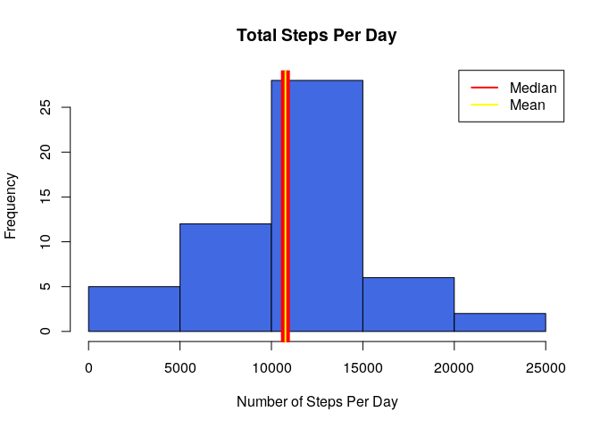
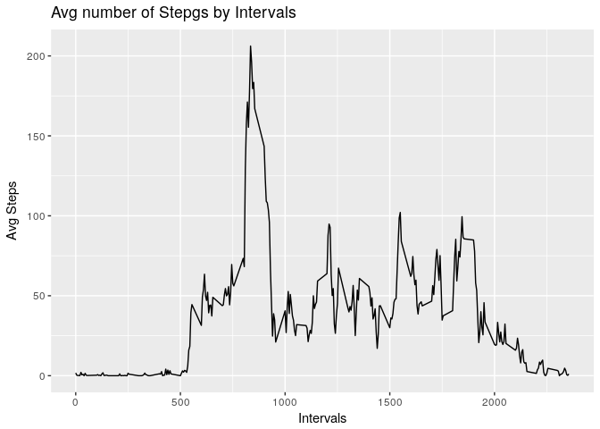
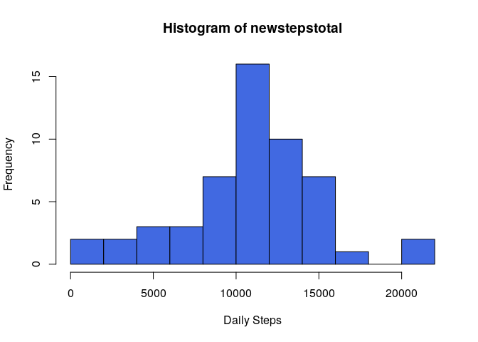
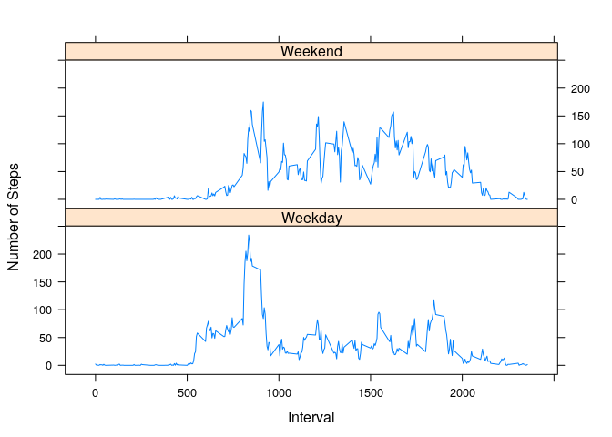

```r
knitr::opts_chunk$set(echo = TRUE)
```

1. First we load the walking activity data

```r
##Load Data
fitness <- read.csv("activity.csv")
        df <- data.frame(fitness)
```
2. Next we will calculate base measure

```r
## Calculations/ Metrics
        stepsbyday <- aggregate(steps ~ date, data = df, sum) ## steps per day
        avgsteps <- mean(stepsbyday$steps)## average steps by day
        median <- median(stepsbyday$steps)## median steps by day
```
3. Following the base measures we plot the average steps by day 

```r
##Plot Histogram & Report Figures
hist(stepsbyday$steps, xlab = "Number of Steps Per Day", main = "Total Steps Per Day", breaks = 4, col = "royal blue") 
        ## Add Metrics
        abline(v = median(stepsbyday$steps), col = "red", lwd = 10)
        abline(v = mean(stepsbyday$steps), col = "yellow", lwd = 2)
        legend(x = "topright", c("Median", "Mean"), col =c("red", "yellow"), lwd = c(2, 2, 2 ))
```

<!-- -->

4. Afterwards we will look at the steps per intervals 4a.First removing NAs by creating new data set than plotting the figures


```r
## Calculate Steps by Interval
        library(ggplot2)
        Intervals <- df[!is.na(df$steps), ] ##remove NAs
        intrv <- aggregate(steps ~ interval, data = Intervals, mean)
                ## Create Plot
                g <- ggplot(intrv, aes(x=intrv$interval, y = intrv$steps), xlab = "Intervals", ylab = "Avg Steps")
                g+geom_line() + xlab("Intervals") + ylab("Avg Steps") + ggtitle("Avg number of Stepgs by Intervals")
```

<!-- -->

```r
                        ##Find Max Step Interval
                        max <- max(intrv)
                        print(max)
```

```
## [1] 2355
```
5. Then we calculate the weight of missing values, i.e(how many missing values are there)
5a. Also we will replace missing values using the value of the average steps per day we calculated before &                create clean data set
5b. Furthermore we will create a new data set which merges orignal data set with new clean data
5c. Lastly we will plot the new set & find new measure
        

```r
## Calculate Weight of Missing Values
                ALLNAs <- as.numeric(is.na(df)) 
                Missing_Val <- sum(ALLNAs)
                print(Missing_Val)
```

```
## [1] 2304
```

```r
                        ##Substitute NAs with average steps per date
                        library(plyr)
                        dfvalues <- Intervals
                        avgsteps_day <- tapply(Intervals$steps, Intervals$interval, mean, na.rm = TRUE, simplify = T)
                        NAdata <- is.na(dfvalues$steps)
                        dfvalues$steps[NAdata] <- avgsteps_day[as.character(dfvalues$interval[NAdata])]
                        
        newstepstotal <- tapply(dfvalues$steps,dfvalues$date, sum, na.rm = TRUE, simplify = T) ## New data Frame
        newstepstotal <- newstepstotal[!is.na(newstepstotal)]
##Plot New Hist & Find New Metrics
                        hist(x = newstepstotal,
                                col = "royal blue",
                                breaks = 10,
                                xlab = "Daily Steps")
```

<!-- -->

```r
                        ##Find Metrics of Newsteptotal
                        summary(newstepstotal)
```

```
##    Min. 1st Qu.  Median    Mean 3rd Qu.    Max. 
##      41    8841   10765   10766   13294   21194
```
6.The last part of our anlysis will be to explore differences between weekend & weekdays
                6a. First create new variable for weekends/weekdays
                6b. Next find value of steps per daytype
                6c. Lastly we'll plot the data

```r
## Segment Data into Weekdays / Weekends
        wd <- !(weekdays(as.Date(df$date)) %in% c("Saturday", "Sunday"))
        wknd <- c("","")
        for (i in 1:length(wd)) {
                if(wd[i]) {wknd[i] <- "Weekday"} else {wknd[i] <- "Weekend"}
        }
        df[, "dayType"] <- factor(wknd) ##new daytpe variable
        
        wk_df <- aggregate(steps~dayType+interval, data = df, mean)##average steps per daytype
        library(lattice)
        xyplot(steps ~ interval | factor(dayType),
               layout = c(1,2),
               xlab = "Interval",
               ylab = "Number of Steps",
               type = "l",
               lty=1,
               data = wk_df)
```

<!-- -->

        
